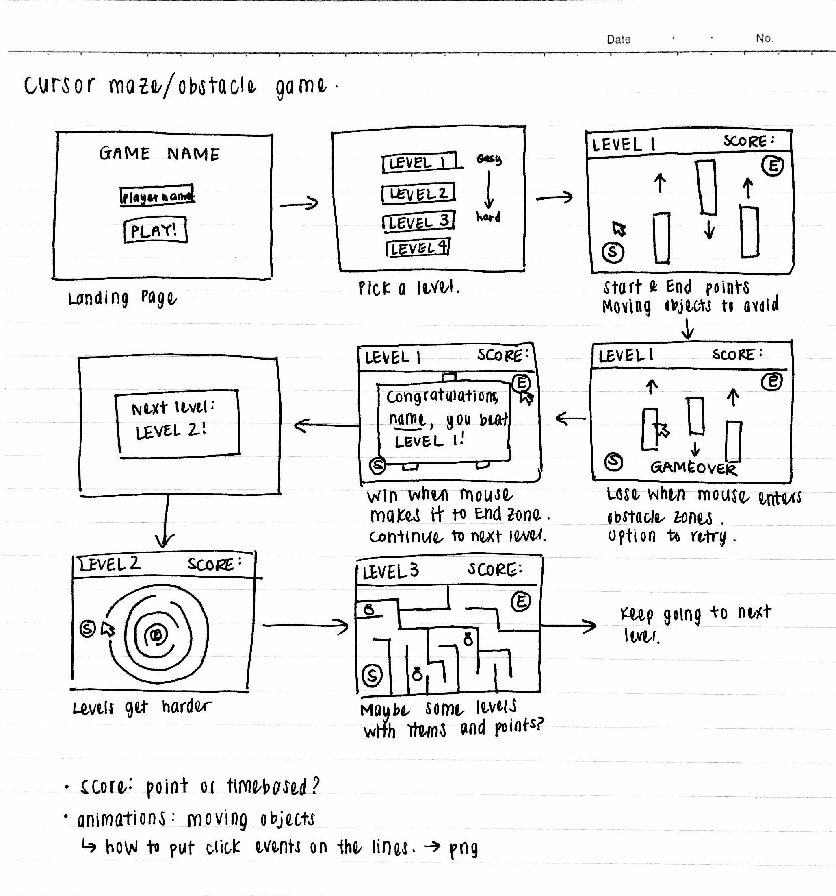

# Project Overview

## Project Schedule
*This schedule will be used to keep track of your progress throughout the week and align with our expectations.*  

You are **responsible** for scheduling time with your squad to seek approval for each deliverable by the end of the corresponding day, excluding `Saturday` and `Sunday`.

|  Day | Deliverable |
|---|---|
|Day 1: Tuesday | Game Idea|
|Day 2: Wednesday | Completed wireframes and prioritized features|
|Day 3: Thursday| Pseudocode|
|Day 4: Friday| Basic Clickable Model|
|Day 5: Saturday| Working Prototype|
|Day 6: Sunday| Game Completed / Slides|
|Day 7: Monday| Project Presentations|

## Project Description
*Use this section to describe your final project and perhaps any links to relevant sites that help convey the concept and/or functionality.*

I was inspired by Operation (the board game!), where you have to accomplish tasks with a steady hand while you try not to touch certain things.  But instead of a board game, I wanted to make an online game utilizing the user's cursor, as they try to make it from the start to end zone without hitting any of the obstacles.  I was thinking of setting it up in a similar way to the dots game we did in class, but instead of trying to click on the dots the user would be avoiding them.

## Priority Matrix
*Include a full list of features that have been prioritized based on the `Time and Importance` Matrix.*

- At least one level with a start and end zone
- Start with stationary obstacles, move up to moving obstacles
- `Level cleared!` and `GAME OVER` pop-ups
- Score display
- Username input

## MVP
*Include the full list of features that will be part of your MVP*

- Username input
- At least one level with a start and end zone
- Start with stationary obstacles, move up to moving obstacles
- Score display
- `Level cleared!` and `GAME OVER` pop-ups
- Some items/tokens to collect for additional points

## POST MVP
*Include the full list of features that you are considering for POST MVP*

- More complicated maze levels
- Scores of other players--to compete
- A timer

## Wireframes

## Game Components
### Landing Page
*What will a player see when they start your game?*

On the landing page, there'll be the name of the game up at the top, with a form where the user can input their name, and a `Play!` button.  There will also be a second landing page, where the user can then select the level they want to start playing at.

### Game Initialization
*What will a player see when the game is started?*

After inputting their name and selecting a level, the level will begin.  Towards the top of the game screen, there will be a information bar with the current level being played, the user's name, the user's score, as well as an exit button.  Each level will have a start and end zone, in which the cursor would have to enter and click to begin and end the game.

### Playing The Game
*What will be the flow of the game, what will the user be expected to do and what will the user expect from the game?*

To play the game, the user must make it across the game screen from the start zone to the end zone without hitting any of the obstacles.  With each level, the number of obstacles, speed, etc. will make it more and more difficult for the user to get to the end zone.  Each level will also have items (coins, gems, not sure exactly what yet) that the user can also choose to collect in order to get a higher score.

### Winning The Game
*What does it look like when the game ends, what determines winning or losing?*

The user wins the level when they make it from the start zone to the end zone without running into any of the level's obstacles.  If the user hits any of the obstacles, they lose.  To win the entire game, all levels must be cleared.

### Game Reset
*How will the user restart the game once it has been completed.*

On the `Level cleared!` or `GAME OVER` pop-up, there will also be an option to `play again`, go to the `next level`, or `return to the menu`.  Playing again would reset the level, and the user can try again.

## Functional Components
*Based on the initial logic defined in the previous game phases section try and breakdown the logic further into functional components, and by that we mean functions.  Does your logic indicate that code could be encapsulated for the purpose of reusablility.  Once a function has been defined it can then be incorporated into a class as a method.*

A lot of my game will consist of event listeners, specifically ones involving mouse click, enter/leave, and hover.

The score keeping would be done by a function (`getScore`) that would add to a `userScore` variable as the user earns point and clears the various levels. If I end up incorporating time to the score, the user would also earn more points the shorter their time. I would need to set up some parameters as to what range of times equate to what number of points.

*Time frames are also key in the development cycle.  You have limited time to code all phases of the game.  Your estimates can then be used to evalute game possibilities based on time needed and the actual time you have before game must be submitted.*

| Component | Priority | Estimated Time | Time Invetsted | Actual Time |
| --- | :---: |  :---: | :---: | :---: |
| Component 1 | H | 10hrs| 12hrs | 12hrs |

## Helper Functions
*Helper functions should be generic enough that they can be reused in other applications. Use this section to document all helper functions that fall into this category.*

| Function | Description |
| --- | :---: |  
| Capitalize | This will capitalize the first letter in a string |

## Additional Libraries
*Use this section to list all supporting libraries and their role in the project.*

## jQuery Discoveries
*Use this section to list some, but not all, of the jQuery methods and\or functionality discovered while working on this project.*

Relevant mouse events:
- `.click()` - The click event is fired when a pointing device button (usually a mouse's primary button) is pressed and released on a single element.
- `.mouseover()` - The mouseover event is fired when a pointing device is moved onto the element that has the listener attached or onto one of its children.
- `.mouseenter()` - The mouseenter event is fired when a pointing device (usually a mouse) is moved over the element that has the listener attached.
- `.mouseleave()`- The mouseleave event is fired when the pointer of a pointing device (usually a mouse) is moved out of an element.

## Change Log
*Use this section to document what changes were made and the reasoning behind those changes.*  

## Issues and Resolutions
*Use this section to list of all major issues encountered and their resolution.*

#### SAMPLE.....
**ERROR**: app.js:34 Uncaught SyntaxError: Unexpected identifier                                
**RESOLUTION**: Missing comma after first object in sources {} object
