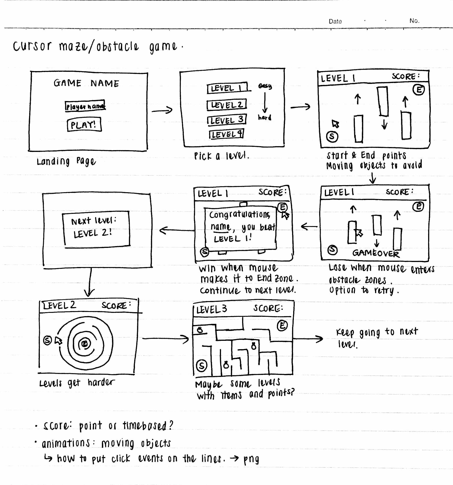

# Donut Touch
Donut Touch is a donut themed cursor game. To win, a user must get from the start zone to the end zone without letting their cursor touch the obstacles or leave the game screen. Donuts are collected for points.

I was inspired by Operation (the board game!), where you have to accomplish tasks with a steady hand while you try not to touch certain things.  But instead of a board game, I wanted to make an online game utilizing the user's cursor, as they try to make it from the start to end zone without hitting any of the obstacles.  

## Priority Matrix
- At least one level with a start and end zone
- Start with stationary obstacles, move up to moving obstacles
- `Level cleared!` and `GAME OVER` pop-ups
- Score display
- Username input

## MVP
- At least one level with a start and end zone
- Start with stationary obstacles, move up to moving obstacles
- Score display
- `Level cleared!` and `GAME OVER` pop-ups
- Some items/tokens to collect for additional points

## POST MVP
- More complicated maze levels
- Scores of other players, highscores
- A timer
- Username input

## Wireframes

## Game Components
### Landing Page
On the landing page, there'll be the name of the game up at the top, with a form where the user can input their name, and a `Play!` button.  There will also be a second landing page, where the user can then select the level they want to start playing at.

### Game Initialization
After inputting their name and selecting a level, the level will begin.  Towards the top of the game screen, there will be a information bar with the current level being played, the user's name, the user's score, as well as an exit button.  Each level will have a start and end zone, in which the cursor would have to enter and click to begin and end the game.

### Playing The Game
To play the game, the user must make it across the game screen from the start zone to the end zone without hitting any of the obstacles.  With each level, the number of obstacles, speed, etc. will make it more and more difficult for the user to get to the end zone.  Each level will also have items (coins, gems, not sure exactly what yet) that the user can also choose to collect in order to get a higher score.

### Winning The Game
The user wins the level when they make it from the start zone to the end zone without running into any of the level's obstacles.  If the user hits any of the obstacles, they lose.  To win the entire game, all levels must be cleared.

### Game Reset
On the `Level cleared!` or `GAME OVER` pop-up, there will also be an option to `play again`, go to the `next level`, or `return to the menu`.  Playing again would reset the level, and the user can try again.

## Functional Components
A lot of my game will consist of event listeners, specifically ones involving mouse click, enter/leave, and hover.

The score keeping would be done by a function (`getScore`) that would add to a `userScore` variable as the user earns point and clears the various levels. If I end up incorporating time to the score, the user would also earn more points the shorter their time. I would need to set up some parameters as to what range of times equate to what number of points.
